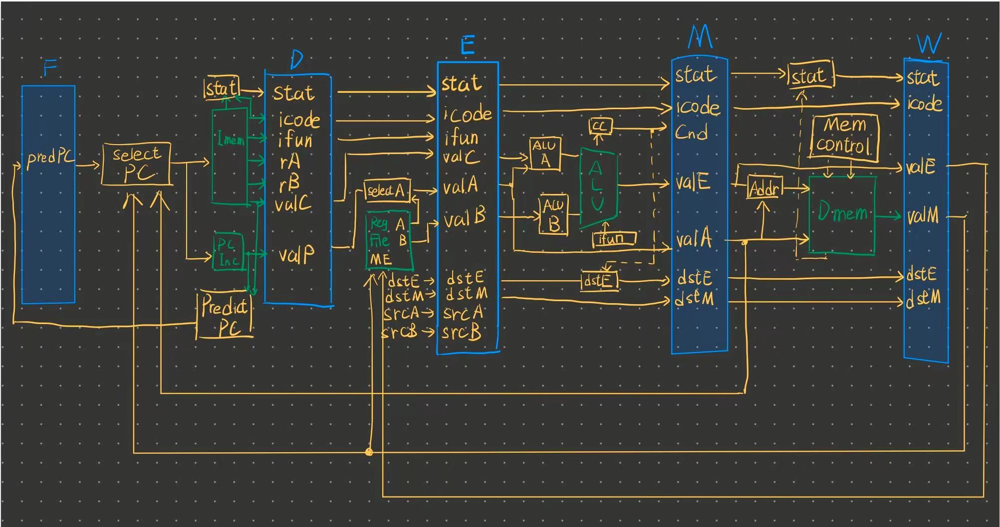
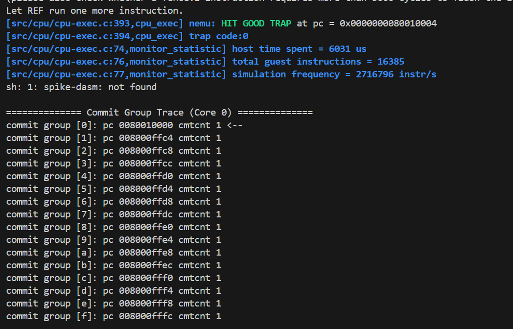

## Lab1报告
##### 季雨昊 23300240010
### 实验目标
1.搭建实验环境  
2.构建五级流水线CPU架构，CPU需要支持以下指令并通过lab1测试：  
算术运算与逻辑运算：  
addi, xori, ori, andi, add, sub, and, or, xor  
扩展指令：  
addiw, addw, subw  
### 实验过程
1.电路设计图的绘制：  
  
2.设计模块的介绍  
1) core.sv：cpu顶层的实例化模块，实例化了取指到写回的各个模块，包括每个模块之间的流水线寄存器。
2) 流水线寄存器reg_FD.sv、reg_DE.sv、reg_EM.sv、reg_MW.sv：现在的功能只有简单的寄存器功能，捕获前一个阶段的数据，并在下一个时钟周期将其传递给下一个阶段，从而保持流水线的连续性和正确性。
3) 取指阶段fetch.sv、pcselect.sv：从指令存储器中取出指令，并将其送入指令寄存器。现在的指令都只需要pc+4就能更新到下一条指令，所以pcselect模块只需要简单地将pc+4送入指令寄存器即可。
4) 译码阶段decode.sv、decoder.sv：decode从指令中提取立即数和寄存器地址，并且示例化了decodeer。decoder利用case条件分支语句从raw_instr中译码出不同的指令。
5) 执行阶段execute.sv、alu.sv：execute提取译码阶段输出的dataD信息，提取出alu的输入信号并实例化alu。alu根据指令进行具体的运算，如add\sub\and\or\xor等。execute还负责进行addw等指令的截断和符号位扩展。
6) 访存阶段memory.sv:由于现在的指令还不需要访存，故只进行了接口的设计，没有具体的内容。
7) 写回阶段writeback.sv：writeback调控regfile的写操作，把运算结构写回目标寄存器。
8) 寄存器文件regfile.sv：负责寄存器的读写操作，参照wiki用regs_nxt进行寄存器状态的更新，便于测试平台的提交。
### 实验结果
hit good trap。能顺利执行测试指令。
