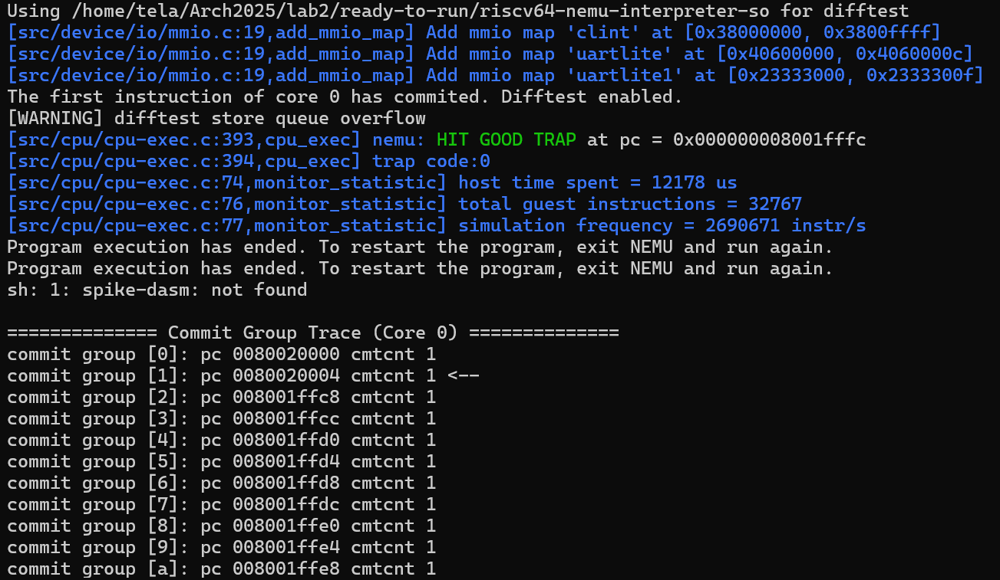

## Lab2报告
##### 季雨昊 23300240010
### 实验目标
1.实现指令ld sd lb lh lw lbu lhu lwu sb sh sw lui  
2.熟悉内存总线的使用  
3.正确处理数据冒险
### 实验过程
1.完善访存阶段的实现  
访存实现在memory.sv中。通过case分支指令解析不同的访存指令，设定访存信号。  
以SD指令为例，实现如下：
``` verilog
  SD:begin
        dreq.valid = 1'b1 & ~dataE.stall;
        dreq.addr = dataE.mem_addr;
        msize = MSIZE8;
        dreq.strobe = strobe;
        dreq.data = writedata;
        isunsigned = 0;
    end
```
其中strobe和访存数据writedata通过位宽msize来指定。  

2.解码阶段，在lab1的基础上添加新指令的译码，并从中解析出访存地址，送给下一阶段。  
在执行阶段，也只需要在lab1基础上稍作扩展，给alu正确输入即可。  
写回阶段不用修改

3.这个实验新加的指令需要使用内存总线。内存对请求信号的响应需要时间。所以，类似于指令访存的阻塞信号的stallpc，我定义了内存访存的阻塞信号stalldata。
```verilog
assign stalldata = dreq.valid & (~dresp.data_ok);
```
当数据总线请求有效(dreq.valid=1)但响应未完成(dresp.data_ok=0)时为高电平。四个流水线寄存器会处理stallpc和stalldata信号，让流水线正在执行访存请求时停顿，各级流水线寄存器会维持信号的现状，等待响应。  


4.在3/10之后，助教更新了测试脚本，降低了内存访问的延时。拉取更新之后经过测试，我发现我的cpu无法很好地处理某些数据冒险。原本内存访问延迟够长，我以为stalldata就足以避免数据冲突，但实际上并非如此，在某些先写后读的指令上会出错。我在core.sv中添加了气泡机制。

```verilog
assign hazard_ra1 = (~stall) && 
          ((~dataE.stall && ra1 == dataE.dst) || 
          (~dataM.stall && ra1 == dataM.dst) || 
          (~dataW.stall && ra1 == dataW.dst));

assign hazard_ra2 = (~stall) && 
          ((~dataE.stall && ra2 == dataE.dst) || 
          (~dataM.stall && ra2 == dataM.dst) || 
          (~dataW.stall && ra2 == dataW.dst));

assign bubble = hazard_ra1 || hazard_ra2;
```
在执行、访存、写回阶段，如果有数据冒险，则会产生气泡。气泡机制会暂停流水线，等待数据冒险的指令完成后再继续流水线。
bubble信号在多个模块中使用，例如在pcselect.sv中，bubble信号会影响下一条指令的PC选择：
```verilog
always_comb begin
    if(stalldata || stall || stallpc || bubble) begin
        pc_selected = pc;
    end
    else begin
        pc_selected = pcplus4;
    end
end
```
当bubble信号为高时，pc_selected保持当前PC值，暂停流水线。  
在流水线寄存器里，bubble信号用于清空寄存器中的数据，以避免错误的数据传递。
### 实验结果
hit good trap。能顺利执行测试指令。
