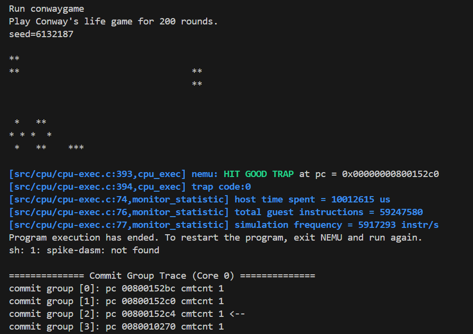

## Lab3报告
##### 季雨昊 23300240010
### 实验目标
1.实现指令beq bne blt bge bltu bgeu
slti sltiu slli srli srai sll slt sltu srl sra slliw srliw sraiw sllw srlw sraw
auipc jalr jal
### 实验过程
1.首先修改译码部分，这个的实现很简单，和前两个lab一致。  
2.修改pcselect部分。原本只有pc+4，现在要根据跳转指令考虑跳转的地址。这个用简单的选择分支就可以实现。  
3.对于位移指令，要扩展alu功能，添加位移计算：
``` verilog
ALU_SL: begin 
        result = a << b[5:0]; 
end
ALU_SRU: begin 
        result = a >> b[5:0]; 
end
ALU_SR: begin 
        result = $signed(a) >>> b[5:0]; 
end
ALU_SRUW: begin
    result = {32'b0, a[31:0] >> b[5:0]};
end
ALU_SRW: begin
    result = {{32{a[31]}}, a[31:0]} >>> b[5:0];
end
```  
4.为了解决跳转指令导致的数据冒险，在原本的bubble判断条件上增加了这个：
``` verilog
assign hazard_jalr = (~stall && dataD.ctl.op == JALR) 
&&((~dataM.stall && ra1 == dataE.dst) ||
(~dataM.stall && ra1 == dataM.dst) ||
(~dataW.stall && ra1 == dataW.dst));
```  
JALR指令使用寄存器值作为跳转目标地址，必须确保读取的是最新值。为了防止前面指令可能还在EX/MEM/WB阶段未写回寄存器，增加了这类bubble。  
### 实验结果
hit good trap。能顺利执行测试指令。
