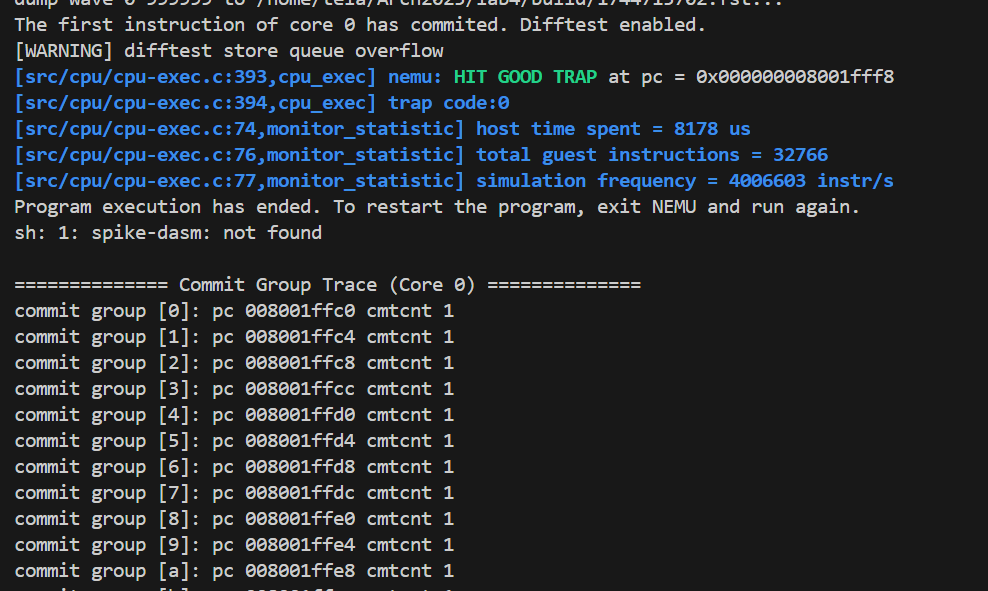
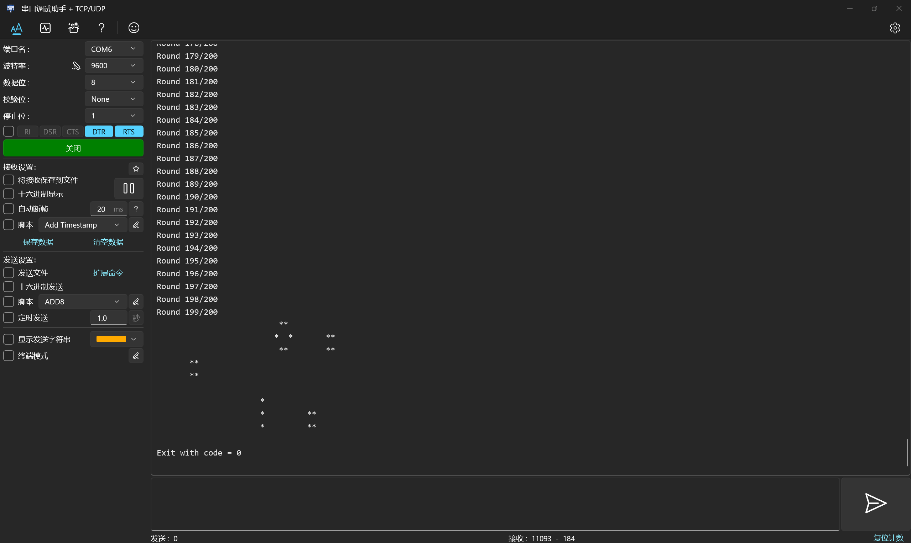
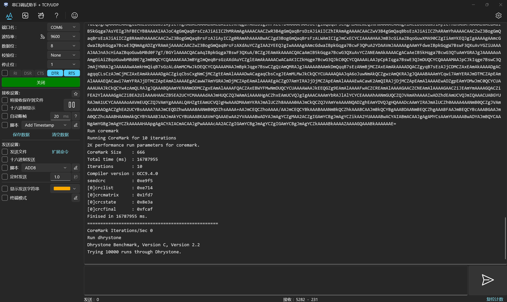

## Lab4报告
##### 季雨昊 23300240010
### 实验目标
1.实现指令：CSRRW CSRRS CSRRC CSRRWI CSRRSI CSRRCI;  
实现寄存器：mstatus mtvec mip mie mscratch mcause mtval mepc mcycle mhartid satp。这些寄存器均为64位宽。  
2.Vivado仿真与上板

### 实验过程
#### 任务一
新增的csr寄存器的存取逻辑基本是按照原本普通寄存器实现的。主要有两点区别：1.写入要考虑掩码；2.每个csr特权指令在同一个指令里既要求写也要求读csr寄存器，同时既要在execute阶段得到应该写回的reg寄存器的值，还有csr寄存器的值。我仿照我的regfile实现了一个csr_regfile进行csr寄存器的存取。另外，我在execute及之后阶段的流水线数据包添加csr_result和csr_addr字段，用于存放csr寄存器的写结果和csr寄存器的写入地址。  
csr_regfile的设计如下：  
```verilog
module csr_regfile
    import common::*;
    import csr_pkg::*;
(
    input logic clk, reset,
    input logic we,
    input u12 wa,
    input word_t wd,
    input u12 ra,
    output word_t rd
);

    word_t csr[2**12] /* verilator public_flat_rd */;
    word_t csr_nxt[2**12] /* verilator public_flat_rd */;
    assign rd = csr[ra];

    initial begin
        for(int i = 0; i < 2**12; i++) begin
            csr[i] = '0;
            csr_nxt[i] = '0;
        end
    end

    always_comb begin
        for(int i = 0; i < 2**12; i++) begin
            csr_nxt[i] = csr[i];
        end
        
        if(we) begin
            case(wa)
                CSR_MSTATUS: csr_nxt[wa] = (csr[wa] & ~MSTATUS_MASK) | (wd & MSTATUS_MASK);
                CSR_SSTATUS: csr_nxt[wa] = (csr[wa] & ~SSTATUS_MASK) | (wd & SSTATUS_MASK);
                CSR_MIP:     csr_nxt[wa] = (csr[wa] & ~MIP_MASK) | (wd & MIP_MASK);
                CSR_MTVEC:   csr_nxt[wa] = (csr[wa] & ~MTVEC_MASK) | (wd & MTVEC_MASK);
                default:      csr_nxt[wa] = wd;
            endcase
        end
        csr_nxt[CSR_MCYCLE] = csr[CSR_MCYCLE] + 1;
        csr_nxt[CSR_MHARTID] = '0;
    end

    always_ff @(posedge clk) begin
        if(reset) begin
            csr[CSR_MSTATUS] <= '0;
            csr[CSR_MTVEC] <= '0;
            csr[CSR_MIP] <= '0;
            csr[CSR_MIE] <= '0;
            csr[CSR_MSCRATCH] <= '0;
            csr[CSR_MCAUSE] <= '0;
            csr[CSR_MTVAL] <= '0;
            csr[CSR_MEPC] <= '0;
            csr[CSR_MCYCLE] <= '0;
            csr[CSR_SATP] <= '0;
        end else begin
            csr <= csr_nxt;
        end
    end

endmodule
```  
在execute阶段区分了针对普通寄存器的result和针对csr寄存器的csr_result，达到了同时处理的效果，避免把新指令当作多个指令分步处理：  
```verilog
CSRRW, CSRRS, CSRRC, CSRRWI, CSRRSI, CSRRCI:begin
                dataE.result = dataD.csr_data;
                dataE.csr_result = result;
            end
```

#### 任务二
上板很顺利，在解决vivado的error和部分warning之后，在课上就运行成功了。

### 实验结果
#### 任务一：hit good trap。能顺利执行测试指令。  
  
#### 任务二：上板运行lab3，成功：  
  

