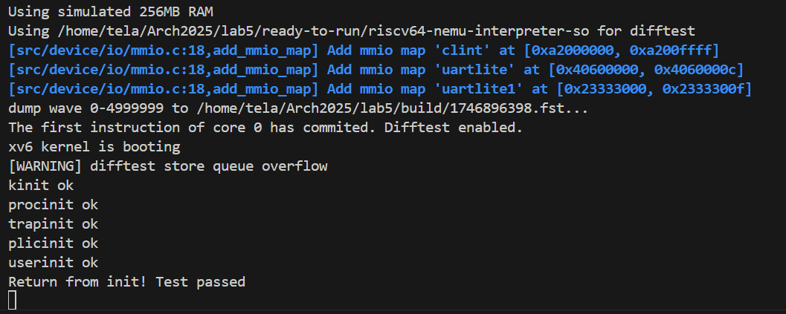
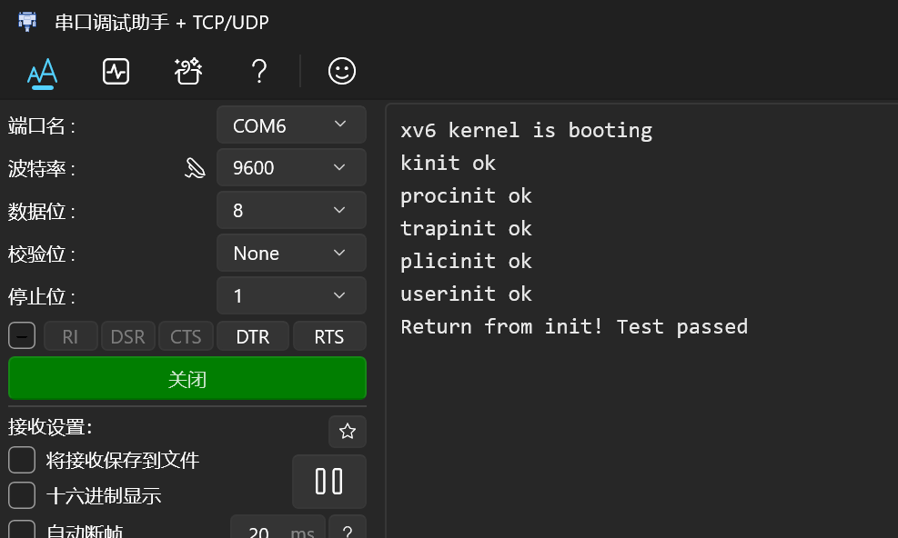

## Lab4报告
##### 季雨昊 23300240010
### 实验目标
1. 实现MRET ECALL MMU
2. vivado上板测试

### 实验过程
#### 任务一
1. mret和ecall指令：  
ecall涉及多个csr寄存器的写入，我重构了csr_regfile的写入接口，现在写入的输入是一个数组，目前数组大小是三，支持同时写入三个csr寄存器，并且方便扩展。  
``` verilog
parameter CSR_OPS_NUM = 3; // Support up to 3 CSR operations per instruction
typedef csr_op_t [CSR_OPS_NUM-1:0] csr_ops_t;

module csr_regfile
    import common::*;
    import csr_pkg::*;
(
    input logic clk, reset,
    // Multi-register write port
    input  csr_ops_t csr_ops,  // {we, wa, wd} for 3 registers
    // Read port
    input u12 ra,
    output word_t rd,
    output word_t csr_mepc_nxt,
    output word_t csr_mtvec_nxt,
    output word_t csr_mstatus_nxt,
    output word_t csr_satp_nxt
);
```  
privilege_mode按如下代码判断，用一个寄存器管理：
```verilog
    always_comb begin
        privilege_mode_nxt = privilege_mode;
        if(reset)begin
            privilege_mode_nxt = PRIVILEGE_M_MODE;
        end
        else if(dataW.ctl.is_mret & ~stallpc)begin //prevent m_mode ireq handled in u_mode
            privilege_mode_nxt = (mstatus_nxt[12:11] == 2'b11) ? PRIVILEGE_M_MODE :
                                (mstatus_nxt[12:11] == 2'b01) ? PRIVILEGE_S_MODE :
                                PRIVILEGE_U_MODE;
        end
        else if(dataW.ctl.is_ecall)begin
            privilege_mode_nxt = PRIVILEGE_M_MODE;
        end
    end

    always_ff @(posedge clk) begin
        if (reset) begin
            privilege_mode <= PRIVILEGE_M_MODE;
        end 
		else begin
            privilege_mode <= privilege_mode_nxt;
        end
    end
```  
2. mmu：  
原本各模块是直接与ibus和dbus沟通，现在把mmu模块当作一个中介。各模块把mmu_ireq/mmu_dreq输入mmu，mmu根据privilege_mode和地址判断是否需要进行地址转换，转换后的请求再由mmu输入ibus和dbus。mmu状态机设置了五个状态：IDLE、LEVEL1、LEVEL2、LEVEL3、FINISH，分别对应接受请求/机器模式透传、第一级地址转换、第二级地址转换、第三级地址转换、发出请求。状态机的状态转换如下：  
``` verilog
state_next = state;
case (state)
    IDLE: if (~m_mode_direct && (mmu_dreq.valid || mmu_ireq.valid))
        state_next = LEVEL1;
    
    LEVEL1: begin
        if (dresp.data_ok) begin
            state_next = LEVEL2;
        end
        if (m_mode_direct) begin
            state_next = IDLE;
        end
    end
    
    LEVEL2: begin
        if (dresp.data_ok) begin
            state_next = LEVEL3;
        end
        if (m_mode_direct) begin
            state_next = IDLE;
        end
    end
    
    LEVEL3: begin
        if (dresp.data_ok) begin
            state_next = FINISH;
        end
        if (m_mode_direct) begin
            state_next = IDLE;
        end
    end
    
    FINISH: begin
        if ((is_fetch ? iresp.data_ok : dresp.data_ok))
            state_next = IDLE;
    end
    
    default: state_next = IDLE;
endcase
```  

#### 任务二
上板过程很曲折，vivado仿真结果和verilator大相径庭。主要有这几个方面出问题：  
reset赋值要完整；  
变量定义和赋值不能再一起；  
不能出现initial；   
vivado识别不了csr_regfile.mepc_nxt这种跨模块导入的信号，必须通过严格的output/input传输变量；   
case和if语句必须覆盖完全，不能漏掉任何情况；  
vivado仿真的波形会和verilator不一样，必须在有问题的地方加强代码的稳健性。  

### 实验结果
#### 任务一：能顺利执行测试指令。  


#### 任务二：上板运行lab5，成功：  
解决完上述问题后，上板测试成功：  

